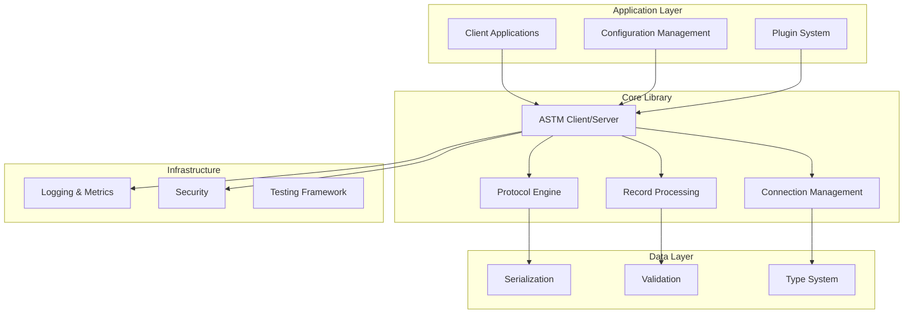

# Design Document

## Overview

The ASTM library modernization will transform the existing codebase into a production-ready, type-safe, and extensible Python library following modern best practices. The design emphasizes maintainability, performance, security, and developer experience while maintaining backward compatibility where possible.

## Architecture

### High-Level Architecture



### Core Components

1. **Protocol Engine**: Handles ASTM message encoding/decoding with modern async patterns
2. **Connection Manager**: Manages async connections with pooling and health monitoring
3. **Record System**: Type-safe record definitions with validation
4. **Configuration System**: Flexible device profiles and runtime configuration
5. **Plugin Framework**: Extensible architecture for custom functionality
6. **Observability Layer**: Comprehensive logging, metrics, and tracing

## Components and Interfaces

### 1. Modern Type System

```python
from typing import Protocol, TypeVar, Generic
from dataclasses import dataclass
from enum import Enum
import pydantic

class ASTMRecord(Protocol):
    """Protocol for ASTM record types"""
    record_type: str
    sequence: int
    
    def to_astm(self) -> list[Any]
    def from_astm(cls, data: list[Any]) -> Self

@dataclass
class ConnectionConfig:
    host: str
    port: int
    timeout: float = 10.0
    encoding: str = "latin-1"
    device_profile: Optional[str] = None
    
class RecordType(Enum):
    HEADER = "H"
    PATIENT = "P"
    ORDER = "O"
    RESULT = "R"
    COMMENT = "C"
    TERMINATOR = "L"
```

### 2. Async Connection Management

```python
class ConnectionPool:
    """Manages multiple ASTM connections with health monitoring"""
    
    async def get_connection(self, config: ConnectionConfig) -> ASTMConnection
    async def release_connection(self, conn: ASTMConnection) -> None
    async def health_check(self) -> Dict[str, ConnectionStatus]

class ASTMConnection:
    """Individual ASTM connection with automatic reconnection"""
    
    async def connect(self) -> None
    async def disconnect(self) -> None
    async def send_records(self, records: Sequence[ASTMRecord]) -> bool
    async def receive_records(self) -> AsyncIterator[ASTMRecord]
```

### 3. Plugin System

```python
class ASTMPlugin(Protocol):
    """Base protocol for ASTM plugins"""
    
    def name(self) -> str
    def version(self) -> str
    def initialize(self, config: Dict[str, Any]) -> None

class RecordPlugin(ASTMPlugin):
    """Plugin for custom record types"""
    
    def supported_record_types(self) -> Set[str]
    def parse_record(self, record_type: str, data: list[Any]) -> ASTMRecord
    def serialize_record(self, record: ASTMRecord) -> list[Any]

class MiddlewarePlugin(ASTMPlugin):
    """Plugin for request/response processing"""
    
    async def process_outbound(self, records: list[ASTMRecord]) -> list[ASTMRecord]
    async def process_inbound(self, records: list[ASTMRecord]) -> list[ASTMRecord]
```

### 4. Configuration System

```python
@dataclass
class DeviceProfile:
    name: str
    vendor: str
    model: str
    record_mappings: Dict[str, Type[ASTMRecord]]
    field_overrides: Dict[str, FieldConfig]
    protocol_quirks: List[str]

class ConfigManager:
    """Manages device profiles and runtime configuration"""
    
    def load_profile(self, name: str) -> DeviceProfile
    def save_profile(self, profile: DeviceProfile) -> None
    def list_profiles(self) -> List[str]
    def validate_config(self, config: Dict[str, Any]) -> ValidationResult
```

## Data Models

### Modern Record Definitions

```python
from pydantic import BaseModel, Field, validator
from datetime import datetime
from decimal import Decimal
from typing import Optional, Union

class HeaderRecord(BaseModel):
    """Modern header record with validation"""
    
    record_type: Literal["H"] = "H"
    delimiter: str = r"\^&"
    message_id: Optional[str] = None
    sender: Optional[str] = None
    timestamp: datetime = Field(default_factory=datetime.now)
    processing_id: str = "P"
    version: Optional[str] = None
    
    @validator('timestamp')
    def validate_timestamp(cls, v):
        if isinstance(v, str):
            return datetime.strptime(v, "%Y%m%d%H%M%S")
        return v
    
    class Config:
        json_encoders = {
            datetime: lambda v: v.strftime("%Y%m%d%H%M%S")
        }

class PatientRecord(BaseModel):
    """Patient record with comprehensive validation"""
    
    record_type: Literal["P"] = "P"
    sequence: int = Field(ge=1, le=99)
    patient_id: Optional[str] = None
    name: Optional[str] = Field(None, max_length=200)
    birthdate: Optional[datetime] = None
    sex: Optional[Literal["M", "F", "U"]] = None
    
    @validator('patient_id')
    def validate_patient_id(cls, v):
        if v and not v.strip():
            raise ValueError("Patient ID cannot be empty")
        return v
```

### Serialization Support

```python
class SerializationManager:
    """Handles multiple serialization formats"""
    
    def to_json(self, records: List[ASTMRecord]) -> str
    def from_json(self, data: str) -> List[ASTMRecord]
    def to_xml(self, records: List[ASTMRecord]) -> str
    def from_xml(self, data: str) -> List[ASTMRecord]
    def to_csv(self, records: List[ASTMRecord]) -> str
    def from_csv(self, data: str, record_type: Type[ASTMRecord]) -> List[ASTMRecord]
```

## Error Handling

### Exception Hierarchy

```python
class ASTMError(Exception):
    """Base exception for ASTM operations"""
    
    def __init__(self, message: str, error_code: Optional[str] = None):
        super().__init__(message)
        self.error_code = error_code
        self.timestamp = datetime.now()

class ProtocolError(ASTMError):
    """ASTM protocol violation errors"""
    pass

class ValidationError(ASTMError):
    """Data validation errors"""
    
    def __init__(self, message: str, field: str, value: Any):
        super().__init__(message)
        self.field = field
        self.value = value

class ConnectionError(ASTMError):
    """Connection-related errors"""
    
    def __init__(self, message: str, host: str, port: int):
        super().__init__(message)
        self.host = host
        self.port = port

class TimeoutError(ConnectionError):
    """Timeout-specific errors"""
    
    def __init__(self, message: str, host: str, port: int, timeout: float):
        super().__init__(message, host, port)
        self.timeout = timeout
```

### Error Context and Recovery

```python
@dataclass
class ErrorContext:
    """Provides context for error handling and recovery"""
    
    operation: str
    timestamp: datetime
    connection_id: str
    record_sequence: Optional[int] = None
    retry_count: int = 0
    max_retries: int = 3

class ErrorHandler:
    """Centralized error handling with recovery strategies"""
    
    async def handle_error(self, error: ASTMError, context: ErrorContext) -> RecoveryAction
    def should_retry(self, error: ASTMError, context: ErrorContext) -> bool
    async def log_error(self, error: ASTMError, context: ErrorContext) -> None
```

## Testing Strategy

### Test Architecture

```python
# Unit Tests
class TestASTMCodec:
    """Test message encoding/decoding"""
    
    def test_encode_header_record(self)
    def test_decode_malformed_message(self)
    def test_checksum_validation(self)

# Integration Tests  
class TestASTMCommunication:
    """Test full communication flow"""
    
    async def test_client_server_communication(self)
    async def test_connection_recovery(self)
    async def test_concurrent_connections(self)

# Property-Based Tests
from hypothesis import given, strategies as st

class TestProtocolCompliance:
    """Property-based testing for protocol compliance"""
    
    @given(st.lists(st.text(), min_size=1, max_size=20))
    def test_encode_decode_roundtrip(self, fields)
    
    @given(st.integers(min_value=1, max_value=7))
    def test_sequence_number_wrapping(self, seq)
```

### Mock Framework

```python
class MockASTMDevice:
    """Mock ASTM device for testing"""
    
    def __init__(self, profile: DeviceProfile):
        self.profile = profile
        self.responses = []
        
    async def start_server(self, port: int) -> None
    async def stop_server(self) -> None
    def add_response(self, records: List[ASTMRecord]) -> None
    def get_received_records(self) -> List[ASTMRecord]
```

## Security

### Security Features

```python
class SecurityManager:
    """Handles security aspects of ASTM communication"""
    
    def enable_tls(self, cert_file: str, key_file: str) -> None
    def validate_certificate(self, cert: bytes) -> bool
    def sanitize_log_data(self, data: str) -> str
    def mask_sensitive_fields(self, record: ASTMRecord) -> ASTMRecord

class AuditLogger:
    """HIPAA-compliant audit logging"""
    
    def log_access(self, user: str, resource: str, action: str) -> None
    def log_data_export(self, user: str, record_count: int, destination: str) -> None
    def log_configuration_change(self, user: str, change: str) -> None
```

### Data Protection

```python
from cryptography.fernet import Fernet

class DataProtection:
    """Handles sensitive data protection"""
    
    def __init__(self, encryption_key: bytes):
        self.cipher = Fernet(encryption_key)
    
    def encrypt_field(self, value: str) -> str
    def decrypt_field(self, encrypted_value: str) -> str
    def hash_identifier(self, identifier: str) -> str
```

## Observability

### Metrics and Monitoring

```python
from prometheus_client import Counter, Histogram, Gauge

class ASTMMetrics:
    """Prometheus metrics for ASTM operations"""
    
    messages_sent = Counter('astm_messages_sent_total', 'Total messages sent')
    messages_received = Counter('astm_messages_received_total', 'Total messages received')
    connection_duration = Histogram('astm_connection_duration_seconds', 'Connection duration')
    active_connections = Gauge('astm_active_connections', 'Active connections')
    
    def record_message_sent(self, record_type: str) -> None
    def record_message_received(self, record_type: str) -> None
    def record_connection_established(self) -> None
    def record_connection_closed(self, duration: float) -> None
```

### Structured Logging

```python
import structlog

class ASTMLogger:
    """Structured logging for ASTM operations"""
    
    def __init__(self):
        self.logger = structlog.get_logger("astm")
    
    def log_connection_attempt(self, host: str, port: int) -> None
    def log_message_sent(self, record_type: str, sequence: int) -> None
    def log_protocol_error(self, error: str, context: Dict[str, Any]) -> None
    def log_performance_metric(self, operation: str, duration: float) -> None
```

## Migration Strategy

### Backward Compatibility

```python
class LegacyAdapter:
    """Provides backward compatibility with existing code"""
    
    def __init__(self, modern_client: ASTMClient):
        self.client = modern_client
    
    # Legacy method signatures
    def send(self, records, chunk_size=None) -> bool
    def connect(self) -> None
    def close(self) -> None
    
    def _convert_legacy_record(self, record) -> ASTMRecord
    def _convert_modern_record(self, record: ASTMRecord) -> list
```

### Migration Tools

```python
class ConfigMigrator:
    """Migrates old configuration to new format"""
    
    def migrate_config(self, old_config: Dict) -> DeviceProfile
    def validate_migration(self, old_config: Dict, new_profile: DeviceProfile) -> bool
    def generate_migration_report(self) -> str

class CodeMigrator:
    """Helps migrate existing code to new API"""
    
    def analyze_usage(self, source_code: str) -> List[MigrationIssue]
    def suggest_replacements(self, issues: List[MigrationIssue]) -> List[CodeSuggestion]
    def generate_migration_guide(self) -> str
```

This design provides a comprehensive modernization approach that addresses all requirements while maintaining the core ASTM functionality. The architecture emphasizes type safety, async operations, extensibility, and production readiness.